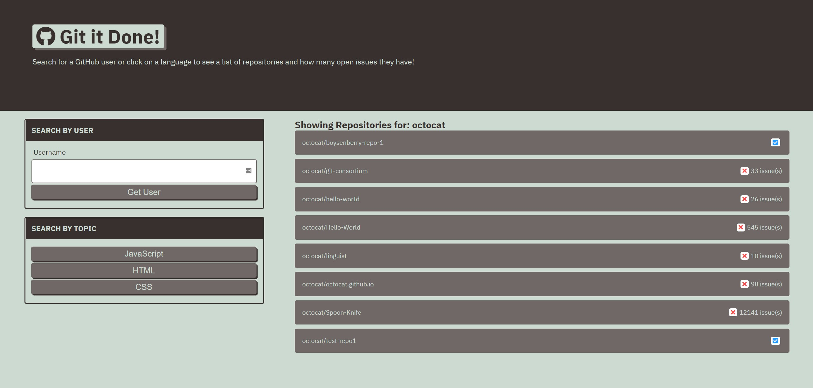

# Git-It-Done

## Description

 A web app that will search GitHub for open source projects with open issues and pull requests. Open source software is software that's free to use, with source code that's public and editable by the community. Contributing to an open source project is a great way to give back to the web development community, network with other developers, and add to your resume. This week, you’ll learn how to do just that.

## Deployed Website

<https://shanebramble.github.io/git-it-done>

### Built With

* HTML
* CSS
* JavaScript/JQuery
* Git REST API

## Contribution

Made with ❤️ by Shane Bramble-Wade

### ©️2021 Git-It-Done, Inc
